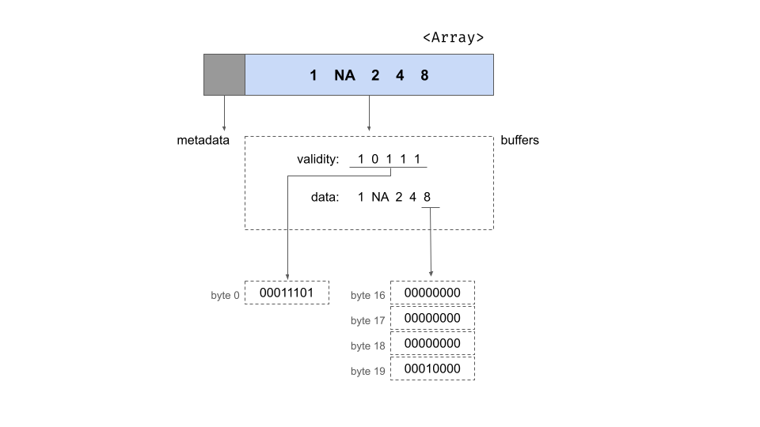

# Abstract

The Apache Arrow ecosystem—comprising Apache Arrow, Arrow Flight, and Arrow Flight SQL—forms a powerful stack for high-performance data processing. Apache Arrow provides a language-agnostic, in-memory columnar format, designed for efficient analytics and zero-copy interoperability. Arrow Flight builds upon this foundation with an RPC framework leveraging gRPC, enabling high-speed data exchange between systems. Arrow Flight SQL extends this by offering a SQL protocol layer, allowing clients to execute SQL queries on remote data sources while using Arrow as the underlying transport format.

This blog explores the architecture, implementation, and performance characteristics of each component, covering memory layout, serialization techniques, RPC mechanisms, and cross-language integration. Through code examples, benchmarks, and visual diagrams, we illustrate how Arrow's design choices translate into real-world efficiency gains for databases, machine learning pipelines, and distributed analytics workloads.

## 1. Apache Arrow: In-Memory Columnar Format

Apache Arrow establishes a standardized, in-memory columnar format optimized for high-performance analytics. Its design promotes efficient CPU utilization, cross-language interoperability, and zero-copy data sharing.

### Columnar Memory Layout

- **Data Organization:**  
  Rather than storing data row-by-row, Arrow arranges data column-by-column. Each column (or Array) is represented by:
  
  - **Metadata:**  
    Information such as the array's length and null count.
  - **Buffers:**  
    Typically, two buffers per column:  
    - A **validity bitmap** that indicates non-null values.  
    - A **data buffer** holding the actual values (e.g., a 32-bit integer array).  

  For example, consider a nullable 32-bit integer array with 5 elements. Its structure includes:  

  - A 64-bit length (5) and a null count.  
  - A validity bitmap (e.g., `1 0 1 1 1` for values `[1, NA, 2, 4, 8]`).  
  - A corresponding data buffer with values (with `NA` represented appropriately).

---
  This layout is illustrated by the below diagram where metadata (gray) stores length and null count, and two buffers (dotted boxes) hold the bitmap and data. Each value is accessed in **O(1) time** via pointer offset arithmetic.



- **Memory Alignment:**  
  Arrow pads and aligns buffers to **8-byte boundaries** (and ideally to **64-byte cache-line boundaries**) to enhance **sequential scanning** and facilitate **SIMD (Single Instruction, Multiple Data) processing**.

### Zero-Copy Sharing and Immutability

- **Zero-Copy Sharing:**  
  Data in Arrow is stored using **relative offsets** instead of **absolute pointers**. This design allows processes to **share data without serialization or copying**. For instance, an Arrow array created in **C++** can be directly shared with **Python** or **Java** simply by transferring the underlying memory buffers.

- **Immutability:**  
  Once created, Arrow arrays are **immutable**. This guarantees **thread-safety** and **consistency** in concurrent environments. Any modification results in the creation of a **new array**, thereby avoiding concurrency issues.

- **Interoperability:**  
  Arrow's **C Data Interface** enables **safe handoffs between different programming languages**. Whether transferring data between **C++ and Python (via PyArrow)** or across other language boundaries, the standardized format ensures that the receiving process can **interpret the memory correctly**. For **persistent or remote data exchange**, Arrow defines an **IPC (Inter-Process Communication) format** using **FlatBuffers** to serialize schema and metadata while transferring raw column buffers as-is.

### Language Implementations

Apache Arrow is **language-agnostic** with consistent implementations across multiple ecosystems:

- **C++:**  
  Utilizes classes like `arrow::Array`, `arrow::Buffer`, and `arrow::RecordBatch`. Memory is managed via a **MemoryPool** that ensures **proper alignment**, with buffers handled through **reference counting** (using `std::shared_ptr`).

- **Rust:**  
  Offered via the `arrow-rs` crate, which uses an **ArrayData** structure to encapsulate buffer pointers and metadata. Rust's implementation uses **Arc** for buffer management and carefully leverages **unsafe code** to maintain **64-bit alignment**.

- **Go:**  
  Employs **Go slices (`[]byte`)** to store buffers, adhering to the same **layout and alignment rules** as defined by the Arrow specification.

The uniformity of the memory layout means that an **Arrow file written in one language (e.g., C++) can be memory-mapped and read seamlessly in another (e.g., Rust or Go) without re-parsing the data**.

### Vectorized Execution and SIMD Optimizations

- **SIMD-Friendly Design:**  
  The contiguous **memory layout** of each column allows operations to be **vectorized**. Arrow's compute kernels for tasks such as **arithmetic operations, filtering, and aggregation** are often optimized with **SIMD instructions**. The **Arrow C++ library**, for example, uses **runtime CPU feature detection** to select between **AVX2 and SSE4.2** instructions, depending on hardware capabilities.

- **Data Locality:**  
  Storing **column values adjacently in memory** maximizes **cache efficiency**. This design choice supports **highly optimized, pipelined execution on modern CPUs**.

### Interoperability and IPC

- **Efficient IPC:**  
  Arrow's design extends beyond **in-memory processing**. Its **IPC format** serializes **record batches** with a lightweight **FlatBuffer header** (storing **schema and buffer sizes**) followed by the **raw memory buffers**. This approach makes it feasible to **write Arrow data to disk** or **transmit it over a network** with minimal overhead.

- **Foundation for Arrow Flight:**  
  The same **IPC format** is later leveraged by **Arrow Flight** for **high-speed, remote data communication**, demonstrating Arrow's role as a **foundational layer** in the broader **Arrow ecosystem**.

## 2. Arrow Flight: High-Performance RPC for Arrow

### Overview and Architecture

Arrow Flight is an **RPC framework** designed for **high-speed transfer of Arrow data** between processes or over the network with minimal overhead. Built on **gRPC**, it utilizes **Arrow's IPC format** as the payload for data streams, avoiding costly serialization.

Instead of converting Arrow data into another format, Flight **transmits Arrow record batches directly**. The protocol organizes data transfer around **FlightData streams**, where clients can:

- **Download data** from a Flight server using `DoGet`
- **Upload data** using `DoPut`
- **Stream bidirectionally** using `DoExchange`

Flight also provides metadata RPCs for discovering datasets and controlling transfers.

### Flight Protocol: Dataset Identification and Retrieval

Datasets in Flight are identified using a **FlightDescriptor**, which can be:

- A **textual path**
- An **opaque command** (e.g., a SQL query or file path)

Clients retrieve data in **two steps**:

1. **Call `GetFlightInfo`** with a descriptor to obtain a `FlightInfo` response, which includes:
   - The **schema**
   - **Size estimates**
   - **End-points** (for distributed transfers)
   - A **Ticket** (a handle for retrieving the data)

2. **Call `DoGet` with the Ticket**, initiating a **stream of Arrow record batches**.

Additional RPC methods include:

- `ListFlights` – List available datasets
- `GetSchema` – Fetch schema without retrieving data
- `DoAction` / `ListActions` – Perform custom commands (e.g., cache control)
- `DoExchange` – A **full-duplex bidirectional stream** for advanced use cases

Flight's use of **gRPC streaming** allows **large datasets** to be sent **as a sequence of Arrow messages** without repeatedly establishing connections.

### Distributed and Parallel Data Transfer

Flight is designed for **high throughput and parallelism**:

- **Distributed clusters** can use a **planner-coordinator** model:
  - A **coordinator node** handles metadata requests.
  - **Data nodes** serve partitions of data.
  - A `GetFlightInfo` request to the coordinator returns **multiple endpoints** for parallel transfer.

- **Parallel retrieval**:
  - The client receives **N endpoints** in `FlightInfo`.
  - It **launches N `DoGet` requests** to different servers simultaneously.
  - This enables **horizontal scaling**, where data is pulled **directly from multiple servers** instead of funneling through one.

### gRPC and Protocol Buffers

Arrow Flight **extends gRPC** with a **custom Protobuf-based API**. The key message type is `FlightData`, which contains:

- **FlightDescriptor** (only set on the first message of a stream)
- **Data header** (Arrow IPC message header for a record batch)
- **Application metadata** (optional)
- **Data body** (raw bytes of the record batch)

Flight optimizes message structure to **minimize copying**, ensuring **zero-copy transfers** whenever possible.

### Zero-Copy Serialization in Flight

A major goal of Flight is to **avoid overhead** in converting Arrow data to Protobuf and back. Implementations achieve **zero-copy** transfers by:

- **Intercepting Arrow buffers** and sending them directly over gRPC.
- **Bypassing Protobuf serialization**, directly writing Arrow data as `grpc::Slice` objects in C++.
- **Leveraging Netty's `ByteBuf`** for zero-copy transfers in Java.

This design achieves **near-hardware-limited throughput**, with **internal tests showing 2-3 GB/s over TCP** on localhost.

Even non-Arrow-aware gRPC clients can receive Flight messages as byte blobs and deserialize them manually, though they won't benefit from zero-copy optimizations.

### Language-Specific Implementations

Arrow Flight is implemented in multiple languages, typically built on each language's gRPC library:

- **C++:**  
  - Provides `arrow::flight::FlightServerBase` and `FlightClient`.
  - Developers subclass `FlightServerBase` and override virtual methods for RPCs (`ListFlights`, `GetFlightInfo`, `DoGet`, etc.).
  - Uses Arrow's memory allocator and zero-copy optimizations.

- **Java:**  
  - Implements `FlightProducer` (or extends `NoOpFlightProducer`).
  - Uses `VectorSchemaRoot` for Arrow data.
  - `FlightServer.builder(...).start()` initializes a Flight server.
  - Built on **gRPC Java** and uses **Netty's direct ByteBuffers** for efficient transfers.

- **Rust:**  
  - Provided by the `arrow-flight` crate, built on **Tonic** (Rust's gRPC library).
  - Uses **async methods** for client-server interactions.
  - Experimental **Flight SQL support** (opt-in via feature flags).

- **Go:**  
  - Part of the **Apache Arrow Go** module.
  - Implements `FlightServiceServer` with gRPC.
  - Uses `[]byte` slices for Arrow buffers.

- **Python:**  
  - Python's Flight implementation is a **binding to the C++ library** (`pyarrow.flight`).

### Memory Handling & Serialization

Arrow Flight is optimized for **direct Arrow data transport**:

- Uses the **Arrow IPC format** as the payload, avoiding serialization overhead.
- Treats `FlightData.data_body` as a **sidecar** for efficient transmission.
- C++ uses `grpc::WriteOptions::setNoCopy()`, and Java utilizes **Netty's reference-counted buffers**.
- Supports **optional compression** of Arrow buffers.

Throughput benchmarks show that **Flight approaches raw socket I/O speeds**, making it one of the fastest RPC solutions for data analytics.

### Use Cases

Arrow Flight is ideal for **low-latency, large-scale data movement**. Common use cases include:

1. **Distributed Query Engines**  
   - Replaces ODBC/JDBC for **fast result set transfers**.
   - Example: Dremio's use of Flight yields **20-50x higher throughput** than ODBC.

2. **Data Services & APIs**  
   - A Flight server in front of **Parquet datasets or databases**.
   - Enables clients to query data in **Arrow format natively**.

3. **Streaming Data Pipelines**  
   - A producer service **streams Arrow record batches** to consumers.
   - Enables real-time ingestion into **AI/ML pipelines**.

4. **Data Lake Access**  
   - Direct, **high-speed retrieval** of Arrow tables from a remote storage system.
   - Maximizes network bandwidth utilization.

5. **Secure Data Transfer**  
   - Built-in **TLS encryption** (using `grpc+tls://` URIs).
   - Authentication via **token-based mechanisms**.
   - OpenTelemetry support for **tracing Flight calls**.

## 3. Arrow Flight SQL: SQL over Arrow Flight

### Overview of Flight SQL

Arrow Flight SQL is a **protocol introduced in Arrow 7.0.0** that extends **Arrow Flight for database connectivity**. While traditional JDBC drivers transmit query results row-by-row, requiring serialization and deserialization at both ends, Flight SQL sends data in Arrow's native format using gRPC streaming, eliminating conversion overhead and enabling parallel retrieval.

Flight SQL is the transport layer, defining how SQL queries and results move between clients and databases over Arrow Flight. ADBC (Arrow Database Connectivity) sits on top of Flight SQL, providing a developer-friendly API for interacting with multiple databases without needing to implement raw Flight SQL calls. This layered architecture enables database vendors to focus on implementing the Flight SQL protocol while application developers can work with the simpler ADBC interface.

The protocol enables clients to:

- **Execute SQL queries**
- **Prepare statements**
- **Retrieve database metadata** (e.g., tables, schemas, catalogs)

Flight SQL defines a **standardized set of RPC calls and message types** for SQL operations, leveraging **Arrow Flight's high-performance transport**. The goal is to provide an **Arrow-native alternative to ODBC/JDBC**, eliminating **row-to-column conversion overhead**.

With Flight SQL, clients can communicate with any database or query engine that implements the Flight SQL API and receive results as **Arrow tables**, which can be directly used in **pandas, Spark, DataFrame libraries, etc., without copy**.

A Flight SQL server acts as a **thin wrapper** around a database engine: it **receives SQL queries, executes them, and streams results back as Arrow data**.

### Flight SQL Protocol and Commands

Flight SQL builds on **Flight RPCs**, utilizing **FlightDescriptor commands** and **Action messages** to represent SQL requests. The protocol defines **specific Protobuf message types** for various operations and supports token-based authentication and TLS encryption, ensuring secure database connectivity in distributed environments.

#### **Metadata Queries** (Database Catalog Info)

- `CommandGetTables` – List tables
- `CommandGetSchemas` – Retrieve schemas
- `CommandGetCatalogs` – Retrieve database catalogs
- `CommandGetSqlInfo` – Fetch DB capabilities
- `CommandGetPrimaryKeys` / `CommandGetExportedKeys` – Retrieve key relationships

#### **Query Execution**

- `CommandStatementQuery` – Execute a **SQL SELECT** query.
- `CommandStatementUpdate` – Execute an **INSERT/UPDATE/DELETE** query, returning affected row count.

#### **Prepared Statements**

- `ActionCreatePreparedStatementRequest` – Client requests query preparation.
- `CommandPreparedStatementQuery` / `CommandPreparedStatementUpdate` – Execute a prepared statement.
- `DoPut` – Used for **parameter binding** by streaming Arrow batches.
- `ActionClosePreparedStatementRequest` – Clean up prepared statements.

### Query Execution Flow in Flight SQL

A **typical SQL query execution** follows this sequence:

1. **Client sends `GetFlightInfo`** with a `FlightDescriptor` containing a `CommandStatementQuery` (SQL string).
2. **Server responds with `FlightInfo`**, including:
   - **Schema** of the result set.
   - **Ticket** representing the execution result.
   - **Optional multiple endpoints** (for distributed retrieval).
3. **Client calls `DoGet`** with the Ticket.
4. **Server streams Arrow record batches** (`FlightData`) to the client.

This flow is analogous to JDBC returning a `ResultSet`, but **entirely in Arrow format**, avoiding row-based transformations.

Metadata queries (e.g., listing tables) follow the same **`GetFlightInfo → DoGet` pattern**.

#### **Prepared Statement Flow**

Prepared statements introduce **multiple RPC interactions**:

1. **Client calls `DoAction`** with `ActionCreatePreparedStatementRequest` (containing the SQL query).
2. **Server responds** with a handle (identifier for the prepared statement).
3. **Client binds parameters** via `DoPut`, sending Arrow batches.
4. **Server executes the prepared statement** for each batch.
5. **Client calls `DoAction`** with `ActionClosePreparedStatementRequest` to clean up.

Despite its complexity, this system **optimizes parameterized queries**, particularly for **batch inserts and updates**.

### **Integration with Database Engines**

A **Flight SQL server** must translate Flight SQL calls into **actual database operations**. Implementations typically subclass a **Flight SQL Producer** interface.

#### **C++ Implementation**

- **`FlightSqlServerBase`**: A base class for Flight SQL servers.
- Provides **overridable methods** (`ExecuteSqlQuery`, `GetTables`, etc.).
- Handles **Flight RPC dispatching** automatically.

Developers **only need to implement SQL execution**, while Flight SQL manages **metadata retrieval, query planning, and data streaming**.

#### **Java Implementation**

- **`FlightSqlProducer`**: Java equivalent of `FlightSqlServerBase`.
- **Can wrap an existing JDBC source** or provide a **native integration**.
- Uses **Arrow's off-heap memory model** for efficient transfers.

#### **Rust & Go Implementations**

- **Rust (`arrow-flight` crate)**: Flight SQL is experimental but provides SQL message definitions.
- **Go**: Uses `FlightServiceServer`, integrating with Go's gRPC framework.

#### **Example Use Cases**

- **DuckDB**: Since DuckDB **natively supports Arrow**, a Flight SQL server can:
  - Receive SQL queries.
  - Execute them within **DuckDB's in-process engine**.
  - Stream results **directly as Arrow tables** without conversion.
- **DataFusion (Rust Query Engine)**: Flight SQL turns DataFusion into a **high-speed SQL service**.
- **Dremio & InfluxDB**: Use Flight SQL to **serve Arrow-based queries faster** than ODBC/JDBC.

Even traditional databases like **PostgreSQL and MySQL** benefit: an adapter can **fetch rows, convert them to Arrow, and serve via Flight SQL**, avoiding **binary/text-based row protocols**.

### **Client-Side Usage**

Flight SQL is **accessible across multiple languages**, with high-level APIs:

- **C++:** `FlightSqlClient` simplifies Flight SQL interactions.
- **Java:** Provides `FlightSqlClient` for executing queries and fetching results.
- **Python:** `pyarrow.flight.FlightSqlClient` allows Python users to run:

```python
  client = flight.FlightSqlClient("grpc://localhost:50051")
  result = client.execute("SELECT * FROM my_table")
```

- Returns Arrow tables directly usable in pandas, NumPy, Spark.
- ADBC (Arrow Database Connectivity): A higher-level abstraction built on Flight SQL.

### Performance Benefits of Flight SQL

Flight SQL's columnar nature eliminates the row-based inefficiencies of ODBC/JDBC:

-Avoids row-to-column conversion (which can consume 60-90% of JDBC data transfer time).
-Supports partitioned result sets, enabling parallel query retrieval.
-Optimized for Arrow-native databases (e.g., DuckDB, DataFusion).
-Maintains transactional integrity (via BeginTransaction / CommitTransaction calls).
-Extensible: New metadata or commands can be added backwards-compatibly.

## The Future of Data Movement

The Apache Arrow ecosystem represents a fundamental shift in how we think about data movement and processing in modern computing. By providing a standardized columnar memory format (Arrow), an efficient RPC framework (Flight), and a SQL interface layer (Flight SQL), it addresses the entire stack of data processing needs:

- **At the Memory Level**: Arrow's zero-copy sharing and SIMD optimization enable unprecedented performance for analytical workloads.
- **At the Network Level**: Flight's streaming protocol and zero-serialization design approach hardware limits for data transfer speeds.
- **At the Application Level**: Flight SQL makes these benefits accessible through familiar SQL interfaces while maintaining Arrow's performance advantages.

As data volumes continue to grow and real-time analytics become increasingly critical, the Arrow ecosystem's importance will only increase. Its adoption by major databases, analytics engines, and data processing frameworks suggests it's becoming the de facto standard for high-performance data exchange.

The future points toward a world where data moves seamlessly between systems, languages, and frameworks, with Arrow as the common foundation. Whether you're building a distributed database, a machine learning pipeline, or a real-time analytics system, the Arrow ecosystem provides the tools needed to handle data at scale with exceptional efficiency.

For developers and organizations looking to stay ahead in the data processing landscape, understanding and adopting the Arrow ecosystem isn't just an optimization—it's becoming a necessity.
