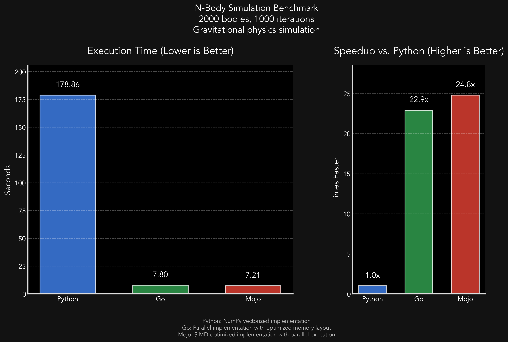

# Mojo is Fast. But is it the Future of Python or Just a Flicker in the Dark?

## Benchmarking Python, Go and Mojo

I couldn’t sleep again last night.

When that happens, I don’t lie awake waiting for rest to find me. I code.

There’s something about the dead hours, when the world is quiet and thoughts are sharper, like steel on a whetstone. And last night, one thought wouldn’t let go.

How fast is Mojo, really?

I’ve seen the hype and bold claims. Python, but fast. Python, unchained. But I don’t care about marketing. Show me the numbers. So I did what I always do when a language promises speed.

I put it to the test.

A benchmark. Nothing fancy, just the N-body simulation, a brutal, CPU-bound physics problem that chews through floating-point math. Three implementations. Python. Go. Mojo. Side by side. No tricks. No magic. Just raw computation.

I chose the N-body simulation for this benchmark because neither I nor ChatGPT know Mojo. But Modular does. Their repo includes a few examples, and N-body happens to be one of them.

If you’d rather dive straight into the code and charts than wade through my words, I get it. The numbers speak for themselves.

Here’s the [repo](https://github.com/TFMV/PyGoMo).

## Bench

As is my way, I over-engineered the hell out of the thing.

First, there’s the bash script. Of course, it uses strict mode with set -euo pipefail, because heaven forbid a silent failure ruin my one-time run. It also features pushd and popd, because clearly, directory changes needed call and response.

Mind you, this script was meant to be run exactly once. But if I’m going to automate something, I’m going to automate it right, even if it never sees the light of day again.

Then you have the Python benchmark script, which the Bash script calls.

Now, you might think this script would be simple. A quick loop, a couple of function calls, maybe a print statement or two. But no. This thing imports Pandas and Matplotlib, as if I were writing a full-blown data analysis pipeline instead of timing how fast my CPU can do math.

Look, if I’m benchmarking something, I want charts. I want CSV exports. I want a performance autopsy, even if all I really need is a stopwatch and a for loop.

I won’t bore you with the details of the individual Python, Go, and Mojo implementations, but suffice it to say, I tried my best.

The numbers had the answers.

## Reckoning

The benchmarks were set. The scripts were ready. The only thing left to do was press run and see who survived.

Then, the terminal came alive:

```bash
☁  PyGoMo [feature/PyGoMo] ⚡  ./run_benchmarks.sh
Checking Python dependencies...
Using requirements.txt from python directory
Building Go implementation...
Checking for Magic command for Mojo...
Magic command found, Mojo benchmarks will be included.
Mojo implementation found at mojo/nbody/nbody.mojo

Running benchmarks...
```

No turning back now.

Would Python limp across the finish line? Would Go hold steady? Would Mojo finally live up to its promises? Does my cat love me?

Then I waited.

Because the Python benchmark runs first.

```bash
Running Python benchmark with 100 bodies...
  Run 1/3: 2.0672 seconds
  Run 2/3: 2.0964 seconds
  Run 3/3: 2.0296 seconds
Python average execution time: 2.0644 seconds

Running Python benchmark with 500 bodies...
  Run 1/3: 53.1252 seconds
  Run 2/3: 52.9157 seconds
  Run 3/3: 52.9705 seconds
Python average execution time: 53.0038 seconds

Running Python benchmark with 1000 bodies...
  Run 1/3: 212.8036 seconds
  Run 2/3: 215.9167 seconds
  Run 3/3: 215.4882 seconds
Python average execution time: 214.7362 seconds

Running Python benchmark with 2000 bodies...
```

Why 2000 bodies? I don’t know. But I needed another Red Bull anyway.

When I came back, Python was still running. And by “running,” I mean deep in existential crisis, questioning the meaning of loops.

So I did the only reasonable thing: I rewrote the Python implementation from scratch. And because I wasn’t in the mood to wait another 15 minutes, I made it self-aware.

Now, it decides at runtime whether to use plain NumPy or Numba JIT acceleration.
Because why not let Python choose how much pain it wants to endure?

I had time to reflect while Python ran. And by reflect, I mean question my life choices. It was around 4AM by this time.



Mojo was fast. Impressively fast. But was it shocking? Not really.

Did it change my life? No.
Did it make me question everything I knew about Python? Not particularly.
Does my cat love me? Unclear.

Mojo is really fast. But until it has Python’s libraries, that speed is waiting for something to do.

> Fast code is nice. Actually being able to use it is better.
